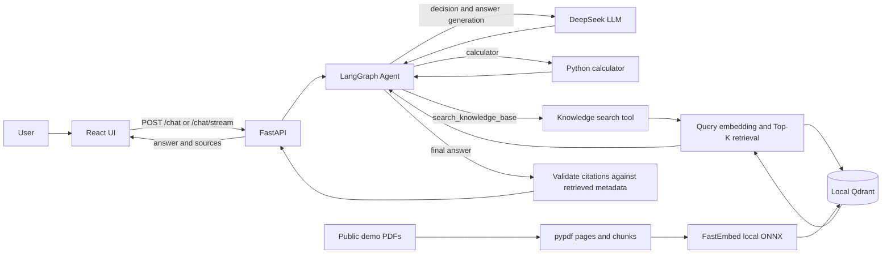
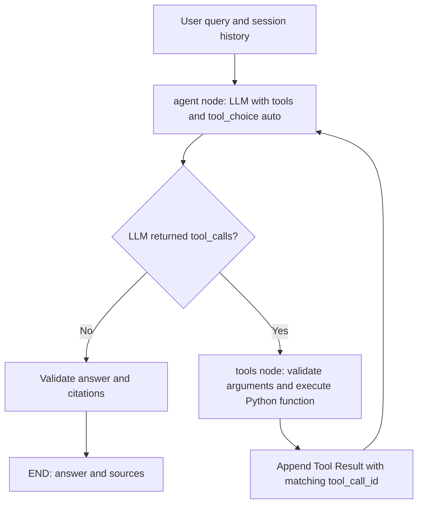

# Enterprise Knowledge Agent

**RAG + LangGraph + Tool Calling 企业知识库智能助手**

面向企业 PDF 的本地 AI 应用作品集：用户可以查询文档制度、连续追问，也可以让 Agent 完成四则运算。系统通过检索片段为回答提供可核对的文件名与页码，并提供 React 聊天界面、SSE 流式输出和可重复的评测。

## Demo 状态

**Local Demo / Deployment Ready。** 已完成本地前后端和生产 Docker 容器验收；尚无经过验证的公开 Demo URL，因此不提供 Live Demo 链接。知识库示例是两份自行生成的虚构 PDF：[企业制度](samples/demo-company-policy.pdf)、[Project Cedar 制度](samples/web-demo-policy.pdf)。

## Core Features

- PDF 逐页解析、切块、本地 embedding、Qdrant 向量检索和独立 RAG 问答。
- LangGraph Agent 通过原生 Tool Calling 自主选择直接回答、`calculator` 或 `search_knowledge_base`。
- 知识库答案的文档和页码来自检索 metadata；普通聊天与纯计算没有文档引用。
- React + TypeScript Chat UI、SSE 增量输出、短期多轮会话、加载和错误状态。
- 启动时可从公开 PDF 自动重建 Demo 知识库；含后端、浏览器与 Docker 验收。

## Architecture



PDF 入库链和用户问答链分开：前者将解析、切块、embedding 后的文档存入 Qdrant；后者由知识工具检索证据并返回 Agent，LLM 再生成回答。独立 `app/rag.py` 复用检索模块，但 Agent 的知识工具**没有直接调用** `run_rag()`。

## RAG Pipeline

`PDF → pypdf 逐页解析 → 每页切块 → 来源 metadata → FastEmbed embedding → 本地 Qdrant → 相似度检索 → Top-K 片段 → LLM 上下文 → 回答`

每个 chunk 保留 `source`（文件名）、`page_number` 和 `chunk_id`；默认大小 500 字符、重叠 50 字符，默认 `Top-K=3`。向量库保存正文和 metadata。模型可在知识回答中选择 `[chunk_id]`，但 `app/citations.py` 只接受真实知识工具结果中的 ID，再从对应 metadata 生成去重的 `{document, page}`。这能拦截编造的引用标记，不能单靠引用验证证明回答完全正确；资料不足时提示词要求明确说明。

## Agent Workflow



`AgentState` 保存消息、工具记录、调用次数、执行路径、最终回答和来源。LangGraph 的 `START → agent`、条件边 `agent → tools/END`、`tools → agent` 构成闭环。是否调用工具取决于 LLM 返回的 `tool_calls`，不是程序按关键词写 `if/else`。单轮最多 4 次 LLM 调用，每次工具节点最多执行 8 个工具调用，另有图递归上限。`InMemorySaver` 按 `session_id` 保存同一进程的会话。

## Tech Stack

| Layer | Current implementation |
| --- | --- |
| Frontend | React 19、TypeScript、Vite 8 |
| HTTP API | FastAPI、Pydantic、Uvicorn |
| Agent / LLM | LangGraph、DeepSeek API（通过 OpenAI Python SDK 兼容接口） |
| Tools | Python `calculator`、`search_knowledge_base`，原生 function schema |
| PDF / chunking | pypdf、逐页字符窗口 |
| Embedding | FastEmbed + 本地 ONNX `BAAI/bge-small-zh-v1.5`（512 维） |
| Vector storage | Qdrant Client 本地模式、Cosine 相似度 |
| Streaming / memory | SSE、LangGraph `InMemorySaver` |
| Tests / container | `unittest`、Playwright、Docker / Compose |

## Project Structure

```text
app/             FastAPI、Agent、工具、PDF/RAG、会话与流式逻辑
frontend/        React UI、API 客户端和 Playwright 浏览器测试
tests/           后端单元测试与 API 测试
evaluation/      19 条公开问题、确定性评分和运行入口
samples/         两份公开虚构 PDF 与验收脚本
docs/stages/      各阶段实现和真实验收记录
```

## Quick Start（Windows PowerShell）

需要 Git、Python（本地验收使用 3.10.6；生产容器使用 3.11）和 Node.js/npm。首次 embedding 需要下载模型；真实 DeepSeek 调用会消耗自己的 API 额度。

```powershell
git clone https://github.com/T-Ye9/enterprise-knowledge-agent.git
cd enterprise-knowledge-agent
python -m venv .venv
.\.venv\Scripts\python.exe -m pip install -r requirements.lock.txt
Copy-Item .env.example .env
```

只在**本机**的 `.env` 中把 `DEEPSEEK_API_KEY=` 填为自己的密钥，并增加一行 `BOOTSTRAP_DEMO_KNOWLEDGE_BASE=true`，让首次启动从两份公开 PDF 建库。不要提交 `.env`。第一个终端启动后端：

```powershell
.\.venv\Scripts\python.exe -m uvicorn app.api:app --host 127.0.0.1 --port 8000
```

第二个终端从仓库根目录启动前端：

```powershell
cd frontend
npm ci
npm run dev
```

访问 <http://127.0.0.1:5173>；API 文档在 <http://127.0.0.1:8000/docs>。试问“你好”“帮我计算 123 * 456”或“员工出差返回后多少个工作日内提交报销材料？”。前端默认连接本地后端；若要调整，复制 [前端环境模板](frontend/.env.example) 为 `frontend/.env.local` 并设置 `VITE_API_URL`。

复现检查：仓库根目录执行后端测试；切到 `frontend/` 后执行前端检查。浏览器测试要求本地前端服务仍在运行，且已安装 Microsoft Edge（现有 Playwright 配置使用 `msedge`）。

```powershell
.\.venv\Scripts\python.exe -m unittest discover -s tests -v
cd frontend
npm run build
npm run test:e2e
```

Docker 的已验收命令是 `docker compose build` 与 `docker compose up -d --wait`，详见 [Stage 15](docs/stages/stage-15-docker.md)。Compose 读取本地 `.env`；站点默认 <http://127.0.0.1:8080>，后端默认 <http://127.0.0.1:8001>。

## Environment Variables

配置模板：[后端开发](.env.example)、[后端生产](.env.production.example)、[前端](frontend/.env.example)。这里不包含真实密钥。

| Variable | Required | Description |
| --- | --- | --- |
| `DEEPSEEK_API_KEY` | 是 | 仅后端；示例 `YOUR_DEEPSEEK_API_KEY`，绝不可提交 Git |
| `DEEPSEEK_BASE_URL` / `DEEPSEEK_MODEL` | 否 | 默认 `https://api.deepseek.com` / `deepseek-flash` |
| `BOOTSTRAP_DEMO_KNOWLEDGE_BASE` | Demo 自动建库时设 `true` | 启动时重建两份公开 PDF；默认 `false` |
| `APP_ENV` / `ALLOW_DOCUMENT_UPLOAD` | 生产环境需明确配置 | 公开 Demo 用 `production` / `false`；本地模板为 `development` / `true` |
| `CORS_ORIGINS` | 跨域生产部署需配置 | 逗号分隔的 HTTPS 前端 origin；本地模板允许 5173 端口 |
| `KNOWLEDGE_DB_PATH` / `EMBEDDING_CACHE_DIR` | 生产环境必填 | 可写绝对路径；本地默认 `data/` 与 `.cache/` |
| `VITE_API_URL` / `VITE_ALLOW_DOCUMENT_UPLOAD` | 按前端环境设置 | 前端构建变量；公开 Demo 指向后端并关闭上传，不可放密钥 |
| `PORT` | 平台自动提供 | 生产入口 `app.server` 读取并监听 `0.0.0.0`；本地默认 8000 |

## API Examples

`GET /health` 返回：

```json
{"status":"ok"}
```

`POST /chat` 接收非空、最多 4000 字符的 `message`，可选 UUID `session_id`；省略时新建会话：

```http
POST /chat
Content-Type: application/json

{"message":"帮我计算 123 * 456"}
```

响应**结构示例**（ID、模型措辞及参数顺序会变化）：

```json
{
  "session_id": "00000000-0000-4000-8000-000000000001",
  "answer": "123 × 456 = 56088",
  "path": ["START", "agent", "tools", "agent", "END"],
  "tool_calls": [{"id": "call_example", "name": "calculator", "arguments": "{\"a\":123,\"b\":456,\"operation\":\"multiply\"}", "result": {"result": 56088}}],
  "llm_calls": 2,
  "sources": []
}
```

`POST /chat/stream` 使用相同 JSON 请求体，返回 `text/event-stream`。事件可能包括 `session`、`reset`、`delta`、`tool_start`、`tool_end`，最后以 `done` 或 `error` 结束。`done` 包含 `session_id`、`answer`、`sources`、`path`、`tool_calls`、`llm_calls`。知识回答的 `sources` 形如 `[{"document":"demo-company-policy.pdf","page":2}]`，页码来自实际检索 metadata。

## Evaluation（Stage 17 实测）

公开 [评测数据集](evaluation/dataset.json) 共 **19 条**：知识 8、多 chunk 2、资料不足 3、计算 3、普通聊天 2、混合工具 1。详情见 [最终 QA 报告](docs/stages/stage-17-final-qa.md)。

| Check | Actual result |
| --- | --- |
| 后端单元/API 测试 | 109/109 通过 |
| 19 条评测整体 | 直接检索 18/19；Agent 报告 18/19，均因同一 `M02` 直接检索附加检查 |
| 工具选择 / Agent 完成 | 各 19/19 |
| 直接 Top-3 检索至少命中一个预期来源 | 11/11 |
| 直接检索覆盖全部来源和证据 | 各 10/11 |
| Agent 来源覆盖 / 引用核对 / 答案依据规则 | 各 11/11 |
| 资料不足拒答 / 计算结果与答案 | 3/3；各 4/4 |
| 浏览器端到端测试 | 11 通过、2 条条件跳过；公开 Demo 模式另测 1 条通过 |

`M02` 同时询问三处事实，单次 Top-3 检索漏掉工作时间片段；Agent 在该次评测中多次检索补齐。评测脚本按设计返回非零退出码，报告仍保存在被忽略的 `evaluation/reports/`。这是**两份短 PDF 的作品集级开发集**，不是生产质量证明；确定性规则也不能证明所有回答都没有幻觉。

## Key Engineering Decisions

1. **先实现 Tool Calling，再引入 LangGraph。** 两个工具仍是真实 Python 函数；图只负责节点、条件路由与循环上限，便于定位选择、参数与执行的故障。
2. **将知识检索暴露为 Tool。** Agent 分别处理聊天、计算和企业事实；知识工具复用 embedding 与检索模块，返回证据而非重复生成答案。
3. **从工具证据生成引用。** 模型选择 `[chunk_id]`，代码从真实 Tool Result metadata 提取文件与页码并去重；事实正确性仍需评测和人工抽查。
4. **公开 Demo 自动重建知识库。** 启用 bootstrap 后，内置虚构 PDF 随服务启动重新入库，适合无持久卷演示；首次启动还需下载 ONNX 模型。
5. **选择 SSE 与进程内短期记忆。** 当前只需服务器单向推送回答；`InMemorySaver` 简化低并发演示，但重启会清空会话。

## Known Limitations & Future Improvements

当前只支持文本型、未加密 PDF，没有 OCR；默认 Top-3 在 `M02` 多事实问题中有明确漏失。Qdrant 本地模式和单进程内存会话面向低并发作品集演示；没有认证、租户隔离或企业级权限。公开部署尚未验收，暂不宣称线上可用。

后续可研究混合检索与 reranking、扩大含干扰项的独立评测集、持久化会话与向量存储、加入身份和文档权限、加强可观测性。这些均未包含在当前实现中。

## Screenshots & Project Notes

仓库目前**没有已提交的 UI 截图**，因此不放失效图片。正式展示前建议人工截取并检查脱敏：① Chat UI；② 知识问答与真实来源页码；③ Agent 工具调用记录或本页架构图。开发过程见 [docs/stages](docs/stages/)；早期 Tool Calling 实验记录见 [EXECUTION_REPORT.md](EXECUTION_REPORT.md)。简历表达和面试提纲见 [Portfolio Summary](docs/PORTFOLIO_SUMMARY.md)。

仓库目前没有 `LICENSE`；代码公开可读不等于授予复用许可，是否采用许可证由维护者决定。
