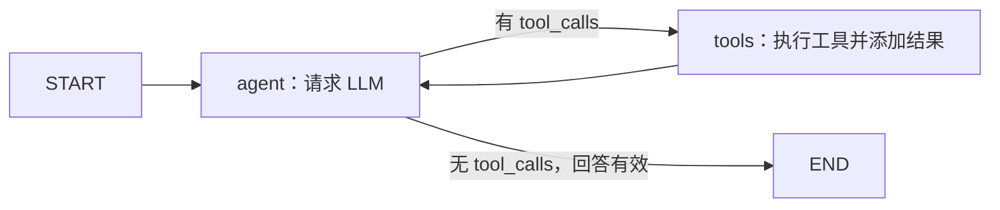

# Stage 08：LangGraph Agent

## 实际起点及实现范围

阶段 7 已有原生 SDK、calculator、知识检索工具及独立 RAG。
检查当前项目未发现 FastAPI 文件或依赖，只有之前讨论过的方案，因此本阶段补齐最小 API 层。
没有重写 RAG、retrieval、向量库或 ingestion，没有 Multi-Agent。
用户明确要求可见的 State、Node、Edge 和循环，因此直接采用 StateGraph；
继续用 OpenAI SDK 调 DeepSeek，不增加 LangChain 提供商封装、create_agent 或预建 Agent。

## 文件职责

| 文件 | 职责 |
|---|---|
| app/agent.py | State、agent/tools 节点、条件路由、图构建、执行路径和防循环 |
| app/tool_runtime.py | 原样迁移原 SYSTEM_PROMPT 和 execute_tool()，共用工具分发 |
| app/main.py | 终端入口，run_conversation() 委托新的 run_agent() |
| app/api.py | Pydantic、/health、/chat，直接调用 Agent 层 |
| tests/test_agent.py | 用真实 LangGraph 和模拟 LLM 验证协议、路径、循环等 |
| tests/test_api.py | HTTP 请求校验、Agent 委托、错误映射和资源关闭 |
| samples/verify_agent.py | 通过 FastAPI TestClient 运行四类真实模型和工具验收 |
| samples/agent_examples.json | 真实答案、path、llm_calls、工具参数和完整结果 |
| requirements.txt | LangGraph、FastAPI、Uvicorn，明确 Pydantic、HTTPX 依赖 |

已有工具函数、Schema、knowledge_tool、rag、解析和检索实现不变。
两个旧测试文件只调整 mock 指向的模块路径，保持原断言。

## State

```python
class AgentState(TypedDict):
    messages: list[dict]
    llm_calls: int
    tool_calls: list[dict]
    path: list[str]
    final_answer: str | None
```

- messages：system、user、assistant、tool 的有序消息，是 LLM 下一次请求的上下文。
- llm_calls：实际调用模型的次数，用于限制费用和循环。
- tool_calls：工具调用 ID、名称、参数、结果，便于核查和来源追踪。
- path：已执行节点序列，最终补 START/END。
- final_answer：只有模型直接返回最终文本时填写。

client 和模型参数由 build_agent() 的闭包持有，不放进 State。
节点返回需要更新的字段；没有 reducer，消息列表按完整快照替换，不隐式追加。
节点用旧列表 + 新消息生成新列表，避免修改之前请求已经使用的状态。
每次 run_agent() 创建新的 State，不设置 checkpointer 或跨请求记忆。
TypedDict 是开发时类型说明，不是 Pydantic 请求校验；HTTP 边界使用 Pydantic。

## Node

agent_node：只请求 LLM，并将返回转换为 assistant 消息。
使用同一 SYSTEM_PROMPT、两个 TOOL_DEFINITIONS、tool_choice="auto" 和非思考模式。
不在此执行工具，也不依据用户关键词选工具。

tool_node：读取上一条 assistant.tool_calls，逐个调用现有 execute_tool()。
把每个结果序列化为 JSON，添加 role="tool"、正确的 tool_call_id 并记录 trace。
同一轮多个工具顺序执行，避免 Qdrant 本地目录被并行客户端争用。

## Edge 与 Conditional Routing



关键图定义：

```python
builder = StateGraph(AgentState)
builder.add_node("agent", agent_node)
builder.add_node("tools", tool_node)
builder.add_edge(START, "agent")
builder.add_conditional_edges(
    "agent", route_after_agent, {"tools": "tools", END: END}
)
builder.add_edge("tools", "agent")
```

add_edge 是固定下一步，add_conditional_edges 由模型响应中的 tool_calls 决定下一步。
route_after_agent() 不做企业问题关键词分类，只检查模型已经作出的调用请求。
END 是图的结束标记，不是额外发请求的节点。

官方资料：[条件边 API](https://reference.langchain.com/python/langgraph/graph/state/StateGraph/add_conditional_edges)、
[官方 Graph API 源文档](https://github.com/langchain-ai/docs/blob/main/docs/src/oss/langgraph/graph-api.mdx)。

## Tool Execution 与 Agent Loop

```text
用户输入
→ START
→ agent：LLM 根据 prompt、问题、工具 Schema 决策
→ tools：calculator 或 search_knowledge_base
→ 原工具函数的真实结果 + metadata
→ agent：模型再次读取工具结果
→ 继续 tools，或结束并返回 Final Answer
```

不输出模型内部推理文本。调试记录的是可观察的节点、边、调用名、参数、结果和答案。
Agent 路径可能包含多次 agent/tools 往返，而不仅一次工具调用。
知识检索复用 search_query()，工具内没有嵌套生成，最终答案由 agent 节点生成。
资料不足时仍遵循阶段 7 的明确拒答要求。

## 防循环

- 默认 MAX_LLM_CALLS=4，最多请求模型 4 次，run_agent() 可覆盖。
- 最后一轮还请求工具时抛出 AgentLimitError，不再执行无法回传给模型的工具。
- MAX_TOOLS_PER_ROUND=8，防止一轮响应请求过多工具。
- graph.invoke(..., config={"recursion_limit": 2 * max_llm_calls + 2})，额外限制图执行步数。
- recursion_limit 计算的是图步数，不是 Python 调用栈深度，也不等于 LLM 请求次数。
- 上限异常不伪装成正常答案。终端抛出明确错误，HTTP 返回 508。

默认正常成功最多 4 次 agent 节点、3 次 tools 节点；每次模型请求沿用 60 秒超时和禁用自动重试。
当前没有总请求时长/费用预算，模型或首次下载的耗时仍需结合实际使用评估。
工具参数错误沿用原 error 结果，返回给 LLM，让它说明错误或重试；重试仍受上限约束。

## API 层

```text
POST /chat
→ ChatRequest 校验 message
→ create_client() 读取 .env
→ run_agent()
→ LangGraph graph
→ ChatResponse：answer + path + tool_calls + llm_calls
```

普通 def 接口在线程池执行，复用同步 SDK。
参考：[FastAPI 同步接口说明](https://fastapi.tiangolo.com/async/)。
message 必须是非空字符串，去除首尾空白；非法请求自动返回 422。
/health 只检查服务能否响应，不验证模型密钥或知识库质量。
配置未就绪返回 503，上游失败 502，超时 504，循环超限 508；不返回密钥或上游异常正文。
客户端在 finally 中关闭。

CHAT_LOCK 让当前单进程的 /chat 串行执行，避免本地 Qdrant 同一路径被并发打开。
这是学习项目的简单约束，吞吐量有限；锁不覆盖外部 CLI 或多个 Uvicorn worker。
当前运行一个 worker，不同时启动其它访问相同数据库的命令。
没有实现持久会话、流式 HTTP、鉴权或多用户生产部署。

## 运行

```powershell
# 先进入项目根目录
.\.venv\Scripts\python.exe -m pip install -r requirements.txt
.\.venv\Scripts\python.exe app/main.py
```

启动 API：

```powershell
.\.venv\Scripts\python.exe -m uvicorn app.api:app --host 127.0.0.1 --port 8000
```

浏览器打开 http://127.0.0.1:8000/docs，通过 POST /chat 的 Try it out 输入：

```json
{"message": "帮我计算 123 * 456"}
```

GET /health 返回 {"status":"ok"}。/chat 回答之外增加 path 和工具 trace，便于本阶段验收。
Trace 可能包含企业正文，只在本地调试；私有检索输出继续不要提交到 Git。

## 验证

```powershell
.\.venv\Scripts\python.exe -m unittest discover -s tests -p test_agent.py -v
.\.venv\Scripts\python.exe -m unittest discover -s tests -p test_api.py -v
.\.venv\Scripts\python.exe samples/verify_agent.py
```

离线测试运行真实 LangGraph，但使用模拟模型，不证明模型一定选对工具。
verify_agent.py 通过 ASGI TestClient 验证真实 API → Graph → LLM → 真实工具；
它不是外部网络 socket 测试。真实验收消耗 API 额度，使用已有公开样本库，不重新 ingestion。

2026-09-18 实际验收完成，使用 Python 3.10.6、LangGraph 1.2.11、FastAPI 0.141.1、
Uvicorn 0.53.0，模型 deepseek-flash，沿用已有公开样本数据库。

| 问题 | Agent 路径 | 工具 | LLM 次数 | 实际回答摘要 |
|---|---|---|---|---|
| 普通自我介绍 | START → agent → END | 无 | 1 | 直接介绍能力 |
| 帮我计算 123 * 456 | START → agent → tools → agent → END | calculator | 2 | 123 × 456 = 56088 |
| 出差报销期限 | START → agent → tools → agent → END | search_knowledge_base（同轮 2 次） | 2 | 返回后十个工作日内提交，引用第 2 页 chunk |
| 年终奖金金额 | START → agent → tools → agent → END | search_knowledge_base（同轮 2 次） | 2 | 知识库中没有足够依据，不编造金额 |

知识检索次数由模型决定。同轮两个工具调用都由一次 tools 节点顺序执行，
因此路径只有一个 tools，不把调用数量混同为节点往返次数。
完整参数、真实结果、来源 metadata、答案和路径保存在 samples/agent_examples.json。

- 7 项新 Agent 测试、5 项新 API 测试、36 项原有离线回归测试全部通过，共 48 项。
- Agent 离线测试覆盖多轮循环、同轮多工具、错误参数回传、来源 metadata、
  状态隔离、有效回答、超限不额外执行工具等。
- API 测试覆盖 /health、请求校验、Agent 委托、503/502/504/508 和客户端关闭。
- 4 类真实 FastAPI → LangGraph → LLM → 真实工具链路全部断言通过，HTTP 均为 200。
- 额外启动隐藏的 Uvicorn 于随机本地端口，经真实 HTTP 验证 /health 与 /openapi.json，
  随后停止进程；没有遗留测试服务。
- pip check 通过。没有发现需要修复的应用运行错误。
- 不启用 LangSmith tracing、checkpointer 或外部部署；其包可能作为 LangGraph 的底层依赖安装。

模型下一次运行可能选择不同检索词、调用次数或措辞。通过样本不能保证任意问题都正确。
引用、资料不足判断和 hallucination 仍需核查；LangGraph 让流程可控可见，不保证生成内容正确。

## 面试知识点

1. State 保存执行上下文，Node 更新状态，Edge 表示流程关系。
2. Conditional routing 根据模型的可观察输出决定执行路径。
3. 工具返回后必须带正确调用 ID 回到模型，Agent loop 才是完整闭环。
4. LangGraph 管理编排，不替代工具实现、RAG 或模型推理。
5. 循环上限和图步数上限是两个不同层次的防护。
6. 同一个 Agent 的两个节点不等于 Multi-Agent；本阶段只有一个模型决策主体。
7. 返回 trace 能帮助定位错在模型选择、参数、工具、证据还是生成阶段。
