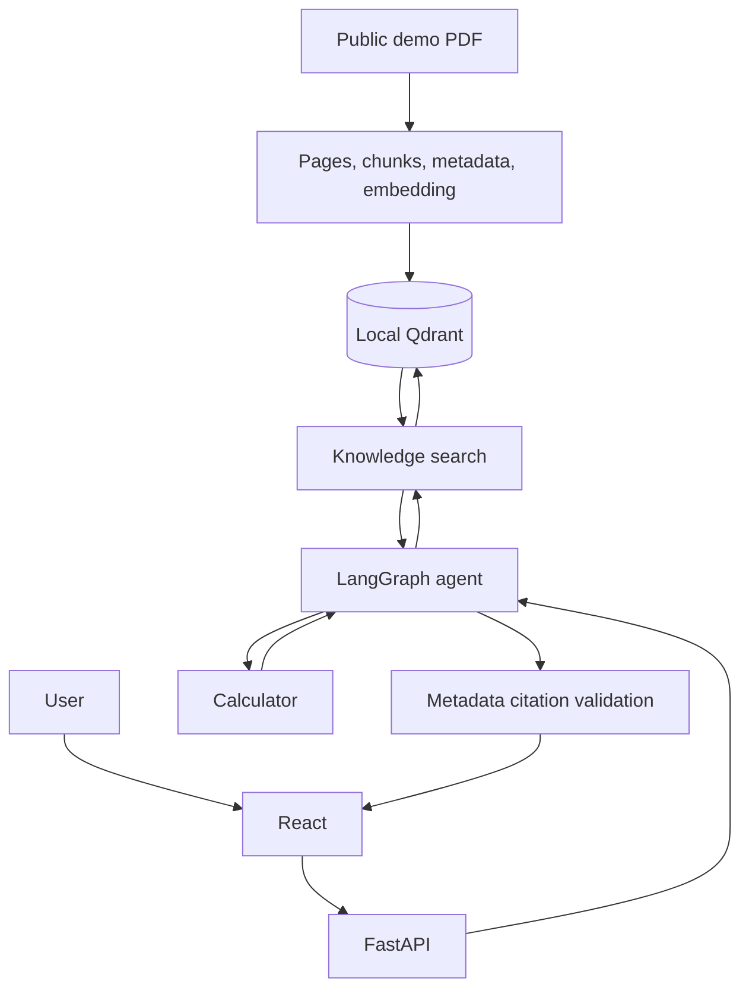

# Stage 18：GitHub Portfolio Packaging

日期：2026-09-20。范围仅为作品集文档整理；没有新增功能、改动产品代码、扩大部署范围或开展阶段 19。

## 1. 项目版本与目标

- 分支：`main`；文档整理前的代码基线提交：`988f2f6d9dcbb554f3f374fbbdfe2405fa19a411`（Stage 17 最终 QA）。
- 目标：让招聘者能快速理解项目用途，让工程师看见实际 RAG / Agent / Tool Calling / Evaluation 链路，让面试官看到有证据的技术取舍。
- 本阶段只修改根 `README.md`，新增 `docs/PORTFOLIO_SUMMARY.md` 和本报告。最终提交以 Git 历史为准。

## 2. README 修改内容

- 改为“项目简介 → Demo 状态 → 核心能力 → 架构 → 运行/接口 → 真实评测 → 决策/限制”的作品集入口，不再按开发阶段倒序堆叠历史。
- 添加系统架构和 LangGraph 工作流两幅 GitHub Mermaid 图；明确 PDF 入库链与用户问答链分开，并明确 Agent 的知识工具复用检索、**不直接调用**独立 `app.rag.run_rag()`。
- 依据 `app.api.ChatRequest/ChatResponse` 写出 `/health`、`/chat`、`/chat/stream` 的真实字段与示例；本地 Windows PowerShell 安装、启动和检查命令来自阶段 17 已验证流程。
- 环境表对照 `app/deployment.py`、`app/llm_client.py`、`app/server.py` 与前端 API 客户端；只使用 `YOUR_DEEPSEEK_API_KEY` 占位符。
- Demo 明确为 **Local Demo / Deployment Ready**，无真实公网 URL、无伪造 UI 截图。
- 用 Stage 17 和本地 `evaluation/reports/stage17-*.json` 的真实结果写 19 条小数据集评测，并保留 `M02` 的 Top-3 失败和局限。

## 3. Architecture Diagram

README 中的完整图展示 React → FastAPI → LangGraph Agent；Agent 的计算工具或知识检索工具；预置 PDF → parsing/chunking → 本地 ONNX embedding → Qdrant；最终来源校验和回答。核心执行关系如下：

模型调用在 README 主图和 Agent 工作流图中单独呈现：它决定工具请求和最终文本，Python 负责执行工具并核对来源。上述简图仅帮助报告阅读，不替代 README 主图。

## 4. GitHub 清理与安全

- 清理了 README 中过时的阶段性叙述和失效的本地评测链接。`docs/stages/` 17 份历史文档和 `EXECUTION_REPORT.md` 保留；后者是 Stage 02 的真实验收记录，并从 README 明确链接，未当作当前架构说明。
- `.gitignore`、根/前端 `.dockerignore` 已覆盖本地 `.env`、虚拟环境、缓存、向量库、私有文档、评测报告、Node 模块和构建产物；Git 跟踪的禁止路径为 **0**。两份 PDF 是公开虚构样本。没有为“清理”而删除阶段记录或公共测试数据。
- 对本地真实 DeepSeek Key 的精确扫描：当前跟踪文本与全部现有 Git 历史命中 **0**；常见 API Key、GitHub token 与私钥签名在跟踪文本中命中 **0**。文档未包含真实密钥。
- 仓库目前没有 `LICENSE`；没有擅自选择许可。`docs/PROJECT_REVIEW.md` 不存在，也没有虚构它的内容。

## 5. Resume bullets

中文与英文各三条完整版本、30 秒/2 分钟讲解、5 个亮点和 5 个追问见 [Portfolio Summary](../PORTFOLIO_SUMMARY.md)。中文简历版的核心表述：

1. 用 pypdf、FastEmbed 和 Qdrant 构建 PDF 检索链路；公开小数据集的直接 Top-3 全部证据覆盖为 **10/11**。
2. 用 LangGraph 编排 DeepSeek 原生工具调用，完成计算、知识检索和直接回答；真实评测工具选择 **19/19**，引用由检索 metadata 核对。
3. 用 FastAPI、React/TypeScript 和 SSE 实现可追问聊天；后端 **109/109** 测试通过，并验证 Docker 冷启动重建 Demo 知识库。

这些结果均属于小型公开数据集和本地验收，不代表生产环境稳定性。

## 6. Demo 与 Evaluation 状态

- Demo：本地 Web 和 Docker 已验收；Railway/Render 公网地址尚未提供或验证，**不是 Live Demo**。
- 评测：两份短虚构 PDF、19 个问题；直接检索报告 **18/19**，Agent 报告 **18/19**，都因 `M02` 的直接检索附加检查。工具选择 **19/19**；全部来源及原文证据的直接检索覆盖各 **10/11**；Agent 来源覆盖、引用核对和答案依据规则各 **11/11**；未知问题拒答 **3/3**。同一 Agent `M02` 通过多次检索补足证据，但评分报告不因此改写成 19/19。
- 原始评测报告保存在被 Git 忽略的 `evaluation/reports/`；公开仓库保留数据集、评测源码、阶段 17 的真实汇总与重跑方法。

## 7. 本阶段验证

- 后端：`.\.venv\Scripts\python.exe -m unittest discover -s tests -q` → **109 tests, OK**。初次受限执行环境无法创建解释器进程；改用获准的环境运行后通过，未改代码。
- 前端：`npm run build` → TypeScript 检查与 Vite 构建通过。
- README：12 个相对链接均指向存在的仓库文件/目录；20 个代码围栏成对；2 幅 Mermaid 代码块；两段 JSON 示例可解析；`git diff --check` 通过。未新增 Mermaid 渲染工具依赖。
- 评测：读取 Stage 17 的两个本地 JSON 原始报告，均 19 例、失败项均为 `M02`；本阶段没有重新调用 LLM 或重跑评测以挑选更好数字。
- 安全：禁止跟踪路径 0、真实 Key 精确命中 0、常见密钥签名命中 0。

## 8. Recruiter Review

- **HR / Recruiter**：首屏直接说明“企业 PDF 问答 + 计算 + 来源”，Demo 状态不含糊。
- **AI 应用开发工程师**：主图、RAG Pipeline、Agent Workflow 和真实评测表能快速定位检索、编排、引用与评测实现。
- **Technical Interviewer**：保留 Tool Calling/Agent 边界、来源可信度、无持久卷重建、SSE 选择和 `M02` 失败，足以追问工程取舍；README 没有把阶段教程复制进来。

## 9. 仍需本人补充

1. 若要声称 Live Demo，须自行完成 Railway/Render 上线并用实际公网 URL 验收聊天与来源；当前不写虚构链接。
2. 可手动拍摄并脱敏 2–3 张截图：Chat UI、RAG 回答加真实 citation、Agent 工具调用或架构展示。当前仓库无已提交截图。
3. 决定是否为仓库添加 `LICENSE`；本阶段没有替维护者选择开源许可。

## 10. Final Result

**阶段 18：PASS**

README 清晰、两幅架构/流程图与代码一致、Quick Start 与已有测试链路一致，评测数字来自真实报告；密钥检查未发现泄漏，简历表达注明了样本边界。仓库适合作为 AI 应用开发实习求职作品集的本地演示与技术讨论材料。

**可以进入阶段 19：项目系统复盘与面试准备。**
